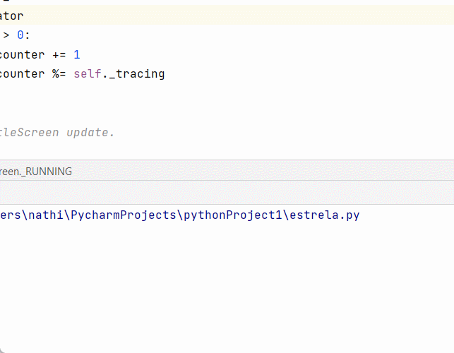
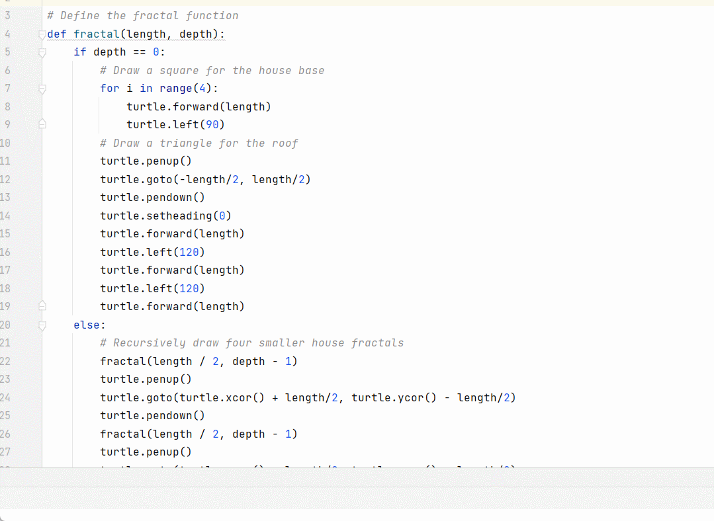
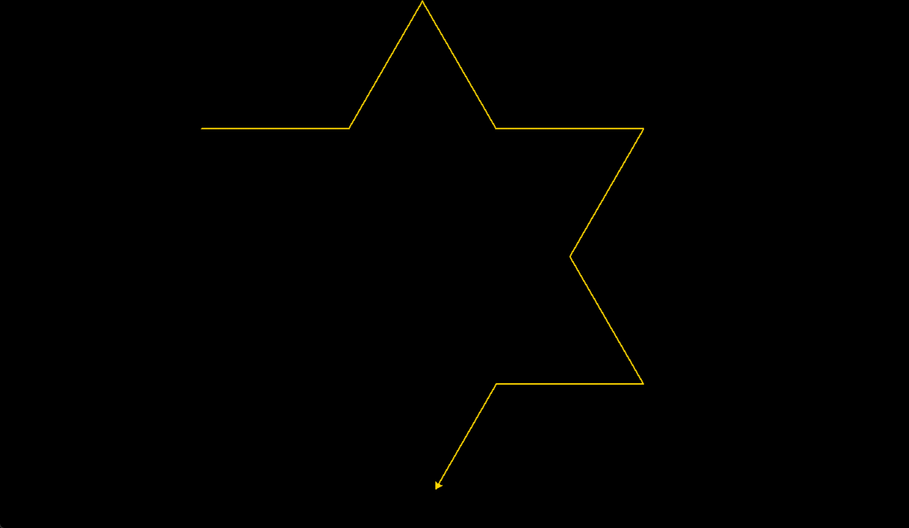

# AulaFractal ⭐

<p>O que são Fractal?</p>

<p>São objetos em que cada parte é semelhante ao objeto como um todo. Isso significa que os padrões da figura inteira são repetidos em cada parte,
só que numa escala de tamanho menor. </p>
<p>Os flocos de neve são exemplos de fractais: cada ramo do floco parece com o floco inteiro. </p>

<p>Uma das características definidoras dos fractais é seu detalhe infinito. Ao ampliar um fractal, você continuará a ver versões cada vez menores do mesmo padrão. </p>
<p>Essa propriedade é conhecida como "autossimilaridade", o que significa que o padrão parece o mesmo em diferentes níveis de escala.</p>

# Criar um triangulo: 🔺🔺🔺

<p align="center">

</p>

```javascrip
import turtle

wn = turtle.Screen()
tess = turtle.Turtle()


def triangle(x, y):
    tess.penup()

    tess.goto(x, y)

    tess.pendown()
    for i in range(3):
        tess.forward(100)

        tess.left(120)

    tess.forward(100)


turtle.onscreenclick(triangle, 1)

turtle.listen()
turtle.done()
```

# Criar um estrela: ⭐
<p align="center">

</p>

```javascrip
import turtle

ws = turtle.Screen()

geekyTurtle = turtle.Turtle()

for i in range(5):
    geekyTurtle.forward(300)

    geekyTurtle.right(144)
    
    turtle.done()
```

# Criar um Espiral Quadrado: 🟪
<p align="center">

</p>

```javascrip
import turtle

turtle.pensize(5)

for i in range(0,700,10):
    turtle.forward(i)
    turtle.left(90)
```

# Criar um Factal Floco de Neve: ❄️
<p align="center">

</p>

```javascrip
import time
import turtle

#Config. screen
WIDTH, HEIGHT = 1600, 900
screen = turtle.Screen()
screen.setup(WIDTH, HEIGHT)
screen.screensize(2*WIDTH, 2*HEIGHT)
screen.bgcolor('black')
screen.delay(0)


#Config. Turtle
trig = turtle.Turtle()
trig.pensize(2)
trig.speed(1)
trig.setpos(-WIDTH // 6, HEIGHT // 6)
trig.color('gold')

# L-system
generation = 5
axiom = 'F++F++F'
chr_1, rule_1 = 'F', 'F-F++F-F'
#chr_2, rule_2 = 'G', 'GG'
step = 600
angle = 60


def apply_rules(axiom):
    return ''.join([rule_1 if chr == chr_1 else chr for chr in axiom])

for gen in range(generation):
    turtle.pencolor('white')
    turtle.goto(-WIDTH // 2 + 60, HEIGHT // 2 - 100)
    turtle.clear()
    turtle.write(f'Geração: {generation}', font=('Arial', 60, "normal"))

    trig.setheading(0)
    trig.goto(-WIDTH // 6, HEIGHT // 6)
    trig.clear()

    length = step / pow(3, gen)

    for chr in axiom:
        if chr == chr_1:
            trig.forward(length)
        elif chr == '+':
            trig.right(angle)
        elif chr == '-':
            trig.left(angle)

    axiom = apply_rules(axiom)

screen.exitonclick()
```

# Arvore: 
<p align="center">

</p>

```javascrip
import turtle

# Define the fractal function
def fractal(length, depth):
    if depth == 0:
        # Draw a square for the house base
        for i in range(4):
            turtle.forward(length)
            turtle.left(90)
        # Draw a triangle for the roof
        turtle.penup()
        turtle.goto(-length/2, length/2)
        turtle.pendown()
        turtle.setheading(0)
        turtle.forward(length)
        turtle.left(120)
        turtle.forward(length)
        turtle.left(120)
        turtle.forward(length)
    else:
        # Recursively draw four smaller house fractals
        fractal(length / 2, depth - 1)
        turtle.penup()
        turtle.goto(turtle.xcor() + length/2, turtle.ycor() - length/2)
        turtle.pendown()
        fractal(length / 2, depth - 1)
        turtle.penup()
        turtle.goto(turtle.xcor() - length/2, turtle.ycor() - length/2)
        turtle.pendown()
        fractal(length / 2, depth - 1)
        turtle.penup()
        turtle.goto(turtle.xcor() - length/2, turtle.ycor() + length/2)
        turtle.pendown()
        fractal(length / 2, depth - 1)

# Set up the turtle window
turtle.setup(800, 800)
turtle.hideturtle()
turtle.speed(0)
turtle.penup()
turtle.goto(-200, -200)
turtle.pendown()

# Call the fractal function
fractal(400, 4)

# Keep the turtle window open until it is manually closed
turtle.done()
```


