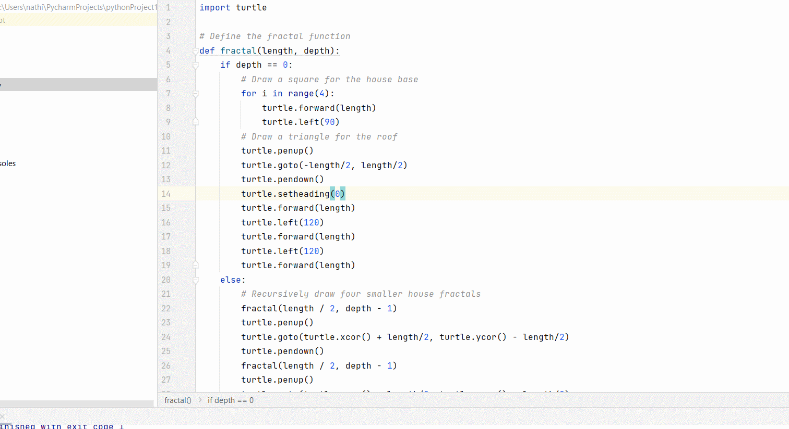

# AulaFractal

<p>O que são Fractal?</p>

<p>São objetos em que cada parte é semelhante ao objeto como um todo. Isso significa que os padrões da figura inteira são repetidos em cada parte,
só que numa escala de tamanho menor. </p>
<p>Os flocos de neve são exemplos de fractais: cada ramo do floco parece com o floco inteiro. </p>

<p>Uma das características definidoras dos fractais é seu detalhe infinito. Ao ampliar um fractal, você continuará a ver versões cada vez menores do mesmo padrão. </p>
<p>Essa propriedade é conhecida como "autossimilaridade", o que significa que o padrão parece o mesmo em diferentes níveis de escala.</p>

<p> Criar um triangulo: </p>

<p align="center">

</p>

```javascrip
import turtle

wn = turtle.Screen()
tess = turtle.Turtle()


def triangle(x, y):
    tess.penup()

    tess.goto(x, y)

    tess.pendown()
    for i in range(3):
        tess.forward(100)

        tess.left(120)

    tess.forward(100)


turtle.onscreenclick(triangle, 1)

turtle.listen()
turtle.done()
```

<p> Criar um estrela: </p>
<p align="center">

</p>

```javascrip
import turtle

ws = turtle.Screen()

geekyTurtle = turtle.Turtle()

for i in range(5):
    geekyTurtle.forward(300)

    geekyTurtle.right(144)
    
    turtle.done()
```

<p> Criar um Espiral Quadrado: </p>
<p align="center">

</p>

```javascrip
import turtle

turtle.pensize(5)

for i in range(0,700,10):
    turtle.forward(i)
    turtle.left(90)
```

<p> Criar um Factal Floco de Neve: </p>
<p align="center">

</p>
